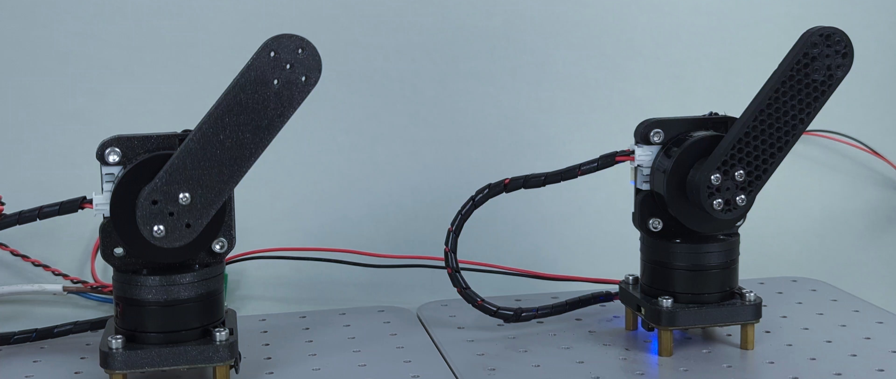

# Bilateral teleoperation guide


## **What is bilateral teleoperation?**
Bilateral teleoperation is a concept that Involves two-way communication where both the operator and the remote device send and receive feedback. The operator controls the device remotely and receives sensory feedback (such as force) from the device to adjust their actions.

The two grippers are virtually coupled to each other, allowing either to act as the master (the haptic interface) or the slave (the manipulator) in the system. We are not using a force sensor at the grippers but are relying on proprioception.



Watch these example videos to get a "feel" of the concept:

- [Gripper bilateral](https://www.youtube.com/watch?v=8jfgFuEFNdI) 
- [2DOF arm bilateral](https://twitter.com/SourceRobotics/status/1812872129148342691)


!!! Note annotate "**What is this used for?**" 
    These kind of setup is perfect for: Teleoperation, Imitation learning, Virtual Environments...

## **The algorithm**
The magic of this setup is done with these 2 simple formulas.

 We got them from amazing Ben Katz paper, creator of mini cheetah quad: [Link to the paper](https://dspace.mit.edu/handle/1721.1/118671?show=full)

 𝜏1,𝑖 = 𝐾𝑝(𝜃2,𝑖 − 𝜃1, 𝑖) + 𝐾𝑑( ˙𝜃2,𝑖 − ˙𝜃1,𝑖) − 𝐾( ˙𝜃1,𝑖)

 𝜏2,𝑖 = 𝐾𝑝(𝜃1,𝑖 − 𝜃2, 𝑖) + 𝐾𝑑( ˙𝜃1,𝑖 − ˙𝜃2,𝑖) − 𝐾( ˙𝜃2,𝑖)

!!! Tip annotate "Learn more!" 
    You can read more on how it works in our [blog post!](https://source-robotics.com/blogs/blog/force-sensitive-grippers-for-teleoperation-and-imitation-learning)


## **What you will need**

We recommend these items to create a simple test jig:

* 2 x spectral micro BLDC - used for 2 wheels 
* Wires to connect everything up: [CAN wires](https://source-robotics.com/products/spectral-micro-can-cable), [Power wires](https://source-robotics.com/products/spectral-micro-power-cable)
* 2 x BLDC motors or SSG48 grippers
* 1 x [CAN adapter](https://source-robotics.com/products/canvas-usb-to-can-adapter)
* 1 x 24V power supply
* A Laptop or raspberry pi
* [UART adapter](https://source-robotics.com/products/usb-to-serial-adapter)

## **Setup**

Here we are showing you the setup for any 2 motors, for example we are using 2 x [ssg48 grippers](https://source-robotics.com/products/compliant-gripper) that are connected in exactly the same setup.


You will need to follow the diagram above to wire everything up.

* First you need to calibrate your Spectral BLDC drivers with the motors you are using. 
* After that change the CAN ids of one of the drivers to CAN 1. You can do it by using UART commands: #CANID 1 and after that #Save
* Now connect CAN adapters CAN bus to one of the drivers and then from that driver connect to the second driver. Make sure that last driver in chain has its CAN termination resistor in "ON" state
* Connect the power to both drivers. You can daisy chain it or use 2 seperate wires.

## **The code**

This code will run on your PC and it will communicate with the drivers from the CAN adapter.


!!! Danger annotate "Advanced example" 
    More advanced code that allows communication over UDP can be found here: [Link](https://github.com/PCrnjak/Spectral-BLDC-Python/tree/main/examples/Advanced/SSG48%20gripper%20bilateral%20teleop) 


``` py title="Spectral_mobile_robot_xbox.py"
import Spectral_BLDC as Spectral
import SourceRoboticsToolbox as SourceRoboticsToolbox
import time
import numpy as np
from math import pi, sin, cos
from spatialmath import *
from typing import Union, Any, List, Optional, cast

Needed_joint_pos = np.array([100,100]) # If using gripper you will need to adjust this
Joint_reduction_ratio = [1, 1] # Reduction ratio we have on our joints

Communication1 = Spectral.CanCommunication(bustype='slcan', channel='COM123', bitrate=1000000)

Motor: list[Union[Spectral.SpectralCAN,Spectral.SpectralCAN]] = []
Motor.append(Spectral.SpectralCAN(node_id=0, communication=Communication1))
Motor.append(Spectral.SpectralCAN(node_id=1, communication=Communication1))


Joint: list[Union[SourceRoboticsToolbox.Joint,SourceRoboticsToolbox.Joint]] = []
Joint.append(SourceRoboticsToolbox.Joint(encoder_resolution = 14, master_position=Needed_joint_pos[0], gear_ratio = Joint_reduction_ratio[0], offset = 0, dir = 0))
Joint.append(SourceRoboticsToolbox.Joint(encoder_resolution = 14, master_position=Needed_joint_pos[1], gear_ratio = Joint_reduction_ratio[1], offset = 0, dir = 0))

timeout_setting = 0.001

initial = 0
initial_setup = [0,0]

# Initialize position values
position_values =  np.array([0.0,0.0])
Motor_values = np.array([0,0])

speed_values = np.array([0,0])

position_send = np.array([0,0])
speed_send = np.array([0,0])
T0 = 0
T1 = 0

received_ids = [0,0] 
Kp = 650
Kd = 0.00550 #  0.0060
Kk = 0.0003 #0.0003


while(1):
    t1 = time.perf_counter()
    Motor[0].Send_data_pack_1(Position = None,Speed = None, Current = int(T0))
    Motor[1].Send_data_pack_1(Position = None,Speed = None, Current = int(T1))

    for i in range(1, 3):  # Loop 9-1=8 to check for received data
        message, UnpackedMessageID = Communication1.receive_can_messages(timeout=timeout_setting)
        #print(f"unpack{i} is: {UnpackedMessageID}")

        # Check if UnpackedMessageID is not None 
        if UnpackedMessageID is not None:
            
            # Update received id index; meaning that we received response from that CAN ID
            received_ids[UnpackedMessageID[0]] = 1
            Motor[UnpackedMessageID[0]].UnpackData(message,UnpackedMessageID)
            #print(f"Motor {UnpackedMessageID[0]}, position is: {Motor[UnpackedMessageID[0]].position}")
            unwrapped_position_raw = Joint[UnpackedMessageID[0]].unwrap_position(Motor[UnpackedMessageID[0]].position)
            Motor_values[UnpackedMessageID[0]] = Motor[UnpackedMessageID[0]].position
            position_values[UnpackedMessageID[0]] =  Joint[UnpackedMessageID[0]].get_joint_position(Motor[UnpackedMessageID[0]].position)

            if initial_setup[UnpackedMessageID[0]] == 0:
                initial_setup[UnpackedMessageID[0]] = 1
                Joint[UnpackedMessageID[0]].determine_sector(Motor[UnpackedMessageID[0]].position)

    # The magic
    T0 = Kp*( position_values[1] -  position_values[0]) + Kd*(Motor[1].speed - Motor[0].speed) - Kk*(Motor[0].speed)
    T1 = Kp*( position_values[0] -  position_values[1]) + Kd*(Motor[0].speed - Motor[1].speed) - Kk*(Motor[1].speed)
    # There are no delays here, we send as fast as possible!


```
