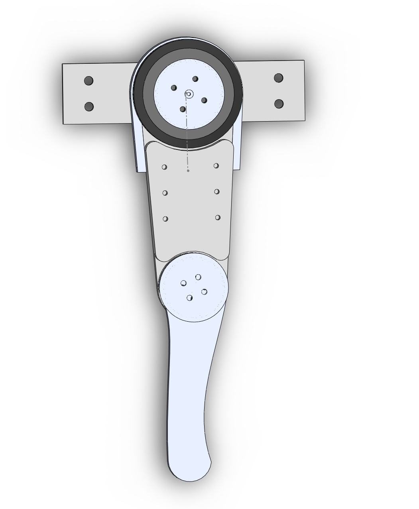
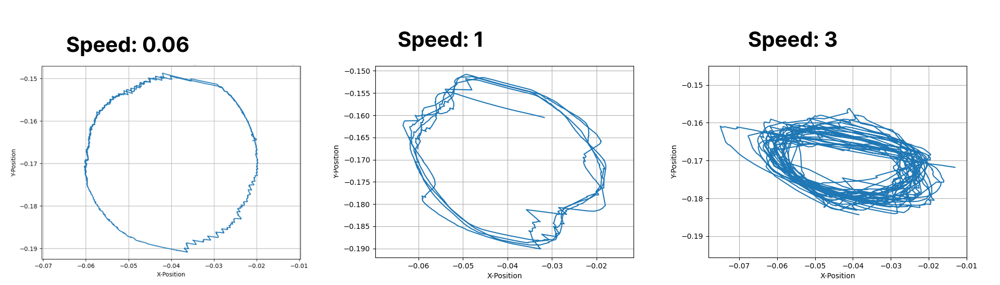

# Robot leg guide

## **Intro**
In this quide we wil show you how you can control a leg of any quadruped robot using Spectral micro BLDC drivers. <br />If you can control one of them you can control all the rest! <br />

!!! Tip annotate "Python API and toolbox" 
    This guide leverages [Spectral BLDC python API](https://github.com/PCrnjak/Spectral-BLDC-Python/tree/main) and [Source robotics toolbox](https://github.com/PCrnjak/Source-Robotics-Toolbox)


<p align="left">  <br /> </p>

!!! Note annotate "Building the LEG" 
    In this guide we only recommend you the hardware you can use to build the robot you designed. We do not offer already made designs you can build!

This guide will cover:

* How to define the robot leg kinematic chain
* How to execute simple trajectories with the leg

What you will need:

* 2 x spectral micro BLDC 
* Wires to connect everything up: [CAN wires](https://source-robotics.com/products/spectral-micro-can-cable), [Power wires](https://source-robotics.com/products/spectral-micro-power-cable)
* 2 x BLDC motors
* 1 x [CAN adapter](https://source-robotics.com/products/canvas-usb-to-can-adapter)
* 1 x 24V power supply
* A Laptop or raspberry pi

<p align="left">  <br /> </p>

The setup will be the same for any kind of quadruped leg. You will need to follow the diagram above to wire everything up.

* First you need to calibrate your Spectral BLDC drivers with the motors you are using. 
* After that change the CAN ids of one of the drivers to CAN 1. You can do it by using UART commands: #CANID 1 and after that #Save
* Now connect CAN adapters CAN bus to one of the drivers and then from that driver connect to the second driver. Make sure that last driver in chain has its CAN termination resistor in "ON" state
* Connect the power to both drivers. (Use daisy chain)

## Leg kinematics

<p align="left">  <br /> </p>

First you will need to assign coordinate frames to your leg model.
We already did it but if you want to learn more on how and why check this [Link](https://automaticaddison.com/how-to-assign-denavit-hartenberg-frames-to-robotic-arms/)<br />

Now we will need to find DH (Denavit-Hartenberg) table values. You can learn more on how and why we did it [Here!](https://automaticaddison.com/how-to-find-denavit-hartenberg-parameter-tables/)

value l1 is 0.112 meters and value l2 is 0.1 meters. The frame 2 is the end / foot of our leg.

## Testing / Calibrating the leg

Before running the main code lets check if the comms are working and get initial position values of our robot leg. This code will try to get data from the 2 motors of our robot leg. We are most interested in positon data of those 2 motors. Position the leg like shown in this image. Run the leg_calib code and write down position values of each motor. 

<p align="left">  <br /> </p>


``` py title="leg_calib.py"

import Spectral_BLDC as Spectral
import time


Communication1 = Spectral.CanCommunication(bustype='slcan', channel='COM6', bitrate=1000000)
Motor = []

Motor.append(Spectral.SpectralCAN(node_id=0, communication=Communication1))
Motor.append(Spectral.SpectralCAN(node_id=1, communication=Communication1)) 


timeout_setting = 0.00005


while True:

    Motor[0].Send_Respond_Encoder_data()
    Motor[1].Send_Respond_Encoder_data()

    for i in range(1, 7):  # Loop 9-1=8 to check for received data
        message, UnpackedMessageID = Communication1.receive_can_messages(timeout=timeout_setting)
        print(f"unpack {i} is: {UnpackedMessageID}")

        # Check if UnpackedMessageID is not None 
        if UnpackedMessageID is not None:
            #print(Motor)
            # Update received id index; meaning that we received response from that CAN ID
            Motor[UnpackedMessageID[0]].UnpackData(message,UnpackedMessageID)
            print(f"Motor {UnpackedMessageID [0]}, speed is: {Motor[UnpackedMessageID[0]].speed}, current is {Motor[UnpackedMessageID[0]].current },pos is {Motor[UnpackedMessageID[0]].position}")
            """
            print(f"Motor {UnpackedMessageID[0]}, speed is: {Motor[UnpackedMessageID[0]].speed}")
            print(f"Error is: {Motor[UnpackedMessageID[0]].error}")
            print(f"Temperature rror is: {Motor[UnpackedMessageID[0]].temperature_error}")
            print(f"Encoder error is: {Motor[UnpackedMessageID[0]].encoder_error}")
            print(f"Vbus error is: {Motor[UnpackedMessageID[0]].vbus_error}")
            print(f"Driver error is: {Motor[UnpackedMessageID[0]].driver_error}")
            print(f"Velocity error is: {Motor[UnpackedMessageID[0]].velocity_error}")
            print(f"Current error is: {Motor[UnpackedMessageID[0]].current_error}")
            print(f"Estop error is: {Motor[UnpackedMessageID[0]].estop_error}")
            print(f"Watchdog error is: {Motor[UnpackedMessageID[0]].watchdog_error}")
            print(f"Calibrated is: {Motor[UnpackedMessageID[0]].calibrated}")
            print(f"Activated is: {Motor[UnpackedMessageID[0]].activated}")
            """


    time.sleep(0.5)
``` 

## Follow a specific trajectory

Joint level control involves directly controlling the angles or positions of the robot's individual joints. Each joint is treated as an independent actuator, and the control system sends commands to each joint to achieve the desired angles. 

For this example we will not use joint level control but a different method called Task/Cartesian Level Control.<br />
 Task or cartesian level control focuses on controlling the position and orientation of the robot's end-effector in a Cartesian coordinate system (X, Y, Z coordinates and orientations). In our robot leg case we dont have Z axes (or orientation) and our end-effector is foot (end of our robot leg).

In this example we will follow a circle trajectory i X,Y plane.
We defined that trajectory with our function generate_circle_coords and with parameters: 

* center - Tuple representing the center coordinates (x, y) in meters
* radius - Radius of the circle in meters
* speed - Speed of the end-effector in meters per second
* time_var - Elapsed time in seconds

<p align="left">  <br /> </p>

How precise you follow the trajectory depends on the speed you set. With low speeds you can track the circle perflectly. With larger speeds the system cant keep up and overshoots. This is due multiple reaseons like:

* Inertia and Momentum: At higher speeds, the inertia and momentum of the robot leg increase, making it harder to change directions quickly and accurately.
* Centrifugal and Coriolis Forces
* Trajectory Planning and Execution - at higher speeds our trajectory has less points to create a full circle. This is due a fixed rate we send data to our motors eg. every 20ms. 
* Feedforward Control: Lack of proper feedforward control can lead to errors in trajectory tracking, as the controller might not anticipate the required accelerations and decelerations.

You can see that from the example with speed set to 1 and 3.


## Example code

This code will make your robot leg draw the above circles. It might look complicated but it is not. Once you understand how this example works you can use it as a base for building more complicated projects. 

``` py title="2DOF_leg_demo.py"
import Spectral_BLDC as Spectral
import SourceRoboticsToolbox as SourceRoboticsToolbox
import time
import numpy as np
# We are using v1.1.0
from roboticstoolbox import DHRobot, RevoluteDH, ERobot, ELink, ETS
from math import pi, sin, cos
from spatialmath import *
from oclock import Timer, loop, interactiveloop
import math
from typing import Union, Any, List, Optional, cast
INTERVAL_S = 0.02


Needed_joint_pos = np.array([14000,2430]) # These are the positions we got from calib code
Joint_reduction_ratio = [1, 0.90476190] # Reduction ratio we have on our joints

# Setup your CAN coms. Change the channel to match your CAN adapter
Communication1 = Spectral.CanCommunication(bustype='slcan', channel='COM6', bitrate=1000000)

# Define our motors
Motor: list[Union[Spectral.SpectralCAN,Spectral.SpectralCAN]] = []
Motor.append(Spectral.SpectralCAN(node_id=0, communication=Communication1))
Motor.append(Spectral.SpectralCAN(node_id=1, communication=Communication1))

# Define the joints
Joint: list[Union[SourceRoboticsToolbox.Joint,SourceRoboticsToolbox.Joint]] = []
Joint.append(SourceRoboticsToolbox.Joint(encoder_resolution = 14, master_position=Needed_joint_pos[0], gear_ratio = Joint_reduction_ratio[0], offset = -np.pi/2, dir = 0))
Joint.append(SourceRoboticsToolbox.Joint(encoder_resolution = 14, master_position=Needed_joint_pos[1], gear_ratio = Joint_reduction_ratio[1], offset = 0, dir = 0))

timeout_setting = 0.001

initial = 0
initial_setup = [0,0]

testing = 5

# Initialize position values
position_values =  np.array([0.0,0.0])
Motor_values = np.array([0,0])
received_ids = [0,0]


# robot length values (metres)
l = [0.112, 0.1]

alpha_DH = [0,0]

# Create robot model using DH params
L1 = RevoluteDH(a=l[0],d = 0,alpha=alpha_DH[0])
L2 = RevoluteDH(a=l[1],d = 0,alpha=alpha_DH[1])
robot = DHRobot([L1,L2], name="Two link")

prev_pos = np.array([0,0])
speed_var = np.array([0,0])

def generate_circle_coords(center, radius, speed, time):
  """
  Generates x,y coordinates for a circle at a given time, considering constant speed.

  Args:
      center: Tuple representing the center coordinates (x, y) in meters.
      radius: Radius of the circle in meters.
      speed: Speed of the end-effector in meters per second.
      time: Elapsed time in seconds.

  Returns:
      Tuple containing the x and y coordinates in meters.
  """

  # Calculate angular displacement based on speed and time
  angular_displacement = speed * time

  # Use parametric equations for a circle to generate coordinates
  x = center[0] + radius * math.cos(angular_displacement)
  y = center[1] + radius * math.sin(angular_displacement)

  return (x, y)

def save_xy_data(filename, xy_data):
  """
  Saves a list of x,y coordinates to a text file.

  Args:
      filename (str): The name of the text file to save the data to.
      xy_data (list): A list of tuples containing x and y coordinates.
  """

  with open(filename, 'a') as file:
    for x, y in xy_data:
      file.write(f"{x},{y}\n")
  
# Example usage with update loop (adjust update_interval for your needs)
center = (-0.04, -0.17)
radius = 0.03
speed = 0.8
time_var = 0

# We are using oclock module to generate stable interval defined with INTERVAL_S
timer = Timer(interval=INTERVAL_S, warnings=False, precise=True)
while timer.elapsed_time < 1100000:

    t1 = time.perf_counter()
    #Motor[0].Send_Respond_Encoder_data()
    #Motor[1].Send_Respond_Encoder_data()
    Motor[0].Send_data_pack_1(Position = Needed_joint_pos[0],Speed = speed_var[0], Current = 0)
    Motor[1].Send_data_pack_1(Position = Needed_joint_pos[1],Speed = speed_var[1], Current = 0)

    # Handles data we get from the motors
    for i in range(1, 3):  # Loop 9-1=8 to check for received data
        message, UnpackedMessageID = Communication1.receive_can_messages(timeout=timeout_setting)
        #print(f"unpack{i} is: {UnpackedMessageID}")

        # Check if UnpackedMessageID is not None 
        if UnpackedMessageID is not None:
            
            # Update received id index; meaning that we received response from that CAN ID
            received_ids[UnpackedMessageID[0]] = 1
            Motor[UnpackedMessageID[0]].UnpackData(message,UnpackedMessageID)
            #print(f"Motor {UnpackedMessageID[0]}, position is: {Motor[UnpackedMessageID[0]].position}")
            unwrapped_position_raw = Joint[UnpackedMessageID[0]].unwrap_position(Motor[UnpackedMessageID[0]].position)
            Motor_values[UnpackedMessageID[0]] = Motor[UnpackedMessageID[0]].position
            position_values[UnpackedMessageID[0]] =  Joint[UnpackedMessageID[0]].get_joint_position(Motor[UnpackedMessageID[0]].position)

            if initial_setup[UnpackedMessageID[0]] == 0:
                initial_setup[UnpackedMessageID[0]] = 1
                Joint[UnpackedMessageID[0]].determine_sector(Motor[UnpackedMessageID[0]].position)

    # Generate desired x,y coordinates with respect to time_var
    x, y = generate_circle_coords(center, radius, speed, time_var)

    # Create a matrix with those x,y coordinates
    T2 = SE3(x, y, 0)
    # Perform inverse kinematics (get joint data from x,y data)
    q1 = robot.ik_LM(T2, q0 = [-0.8,-1],mask = [1,1,0,0,0,0])
    Needed_joint_pos[0] = Joint[0].get_encoder_position(q1[0][0])
    Needed_joint_pos[1] = Joint[1].get_encoder_position(q1[0][1])  
    speed_var[0] = ((Needed_joint_pos[0] - prev_pos[0]) / INTERVAL_S)
    speed_var[1] = ((Needed_joint_pos[1] - prev_pos[1]) / INTERVAL_S)
    print(speed_var)
    prev_pos[0] = Needed_joint_pos[0]
    prev_pos[1] = Needed_joint_pos[1]
    # Process or visualize the generated coordinates (x, y)
    #print(f"Time: {time_var:.2f}s, Coordinates: ({x:.4f}, {y:.4f})")

    # Update time
    time_var += INTERVAL_S

    t2 = time.perf_counter()
    #print(f"total time is {t2-t1}")

    T = robot.fkine(position_values)
    xy = T.t
    #print(f"{xy[0]},{xy[1]}")
    xy_data = [(xy[0], xy[1])]  # Assuming xy is a single pair of coordinates
    # Save data to a txt file
    save_xy_data('my_data.txt', xy_data)
    #time.sleep(0.05)

```


## Plot data

Script that will plot the data of your leg:

``` py title="plot_leg_data.py"


import matplotlib.pyplot as plt

def plot_data(filename):
  """
  Plots data from a text file in the format:
  x1, y1
  x2, y2
  ...

  Args:
      filename (str): The name of the text file containing the data.
  """

  try:
    with open(filename, 'r') as file:
      data = file.readlines()

    x_data = []
    y_data = []
    for line in data:
      # Split the line based on comma (",")
      values = line.strip().split(',')

      # Check if there are exactly two values per line
      if len(values) != 2:
        raise ValueError(f"Invalid line format in file '{filename}': {line}")

      try:
        x = float(values[0])
        y = float(values[1])
      except ValueError:
        raise ValueError(f"Invalid data type in file '{filename}': {line}")

      x_data.append(x)
      y_data.append(y)

    # Ensure equal x and y scales
    plt.axis('equal')

    # Create the plot
    plt.plot(x_data, y_data)

    # Customize the plot (optional)
    plt.xlabel('X-Position')
    plt.ylabel('Y-Position')
    plt.title('Data Plot from ' + filename)

    plt.grid(True)
    plt.show()

  except FileNotFoundError:
    print(f"Error: File '{filename}' not found.")
  except (ValueError, TypeError) as e:
    print(f"Error: {e}")

# Example usage
filename = 'C:\\Users\\xx\\Desktop\\test_code\\env\\Robot_leg\\data_2.txt'  # Replace with your actual filename
plot_data(filename)


```