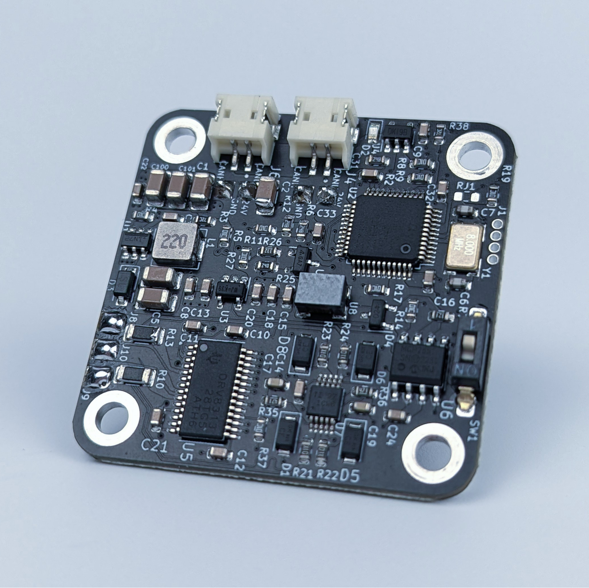
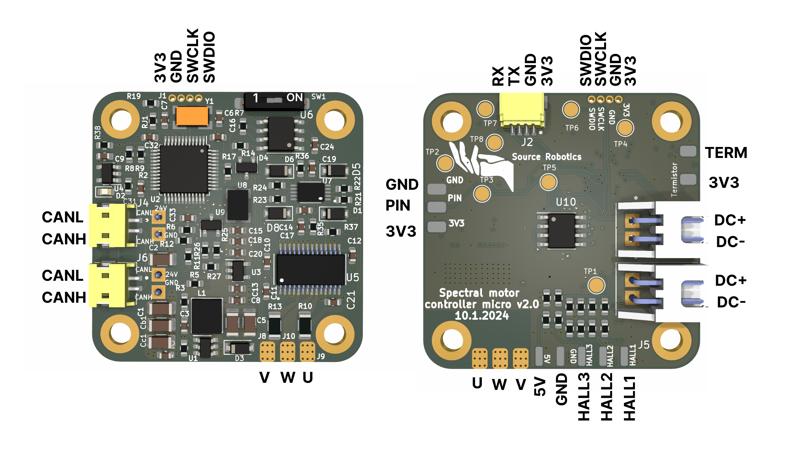
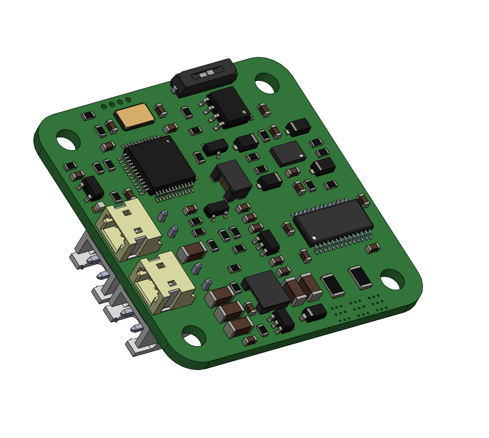
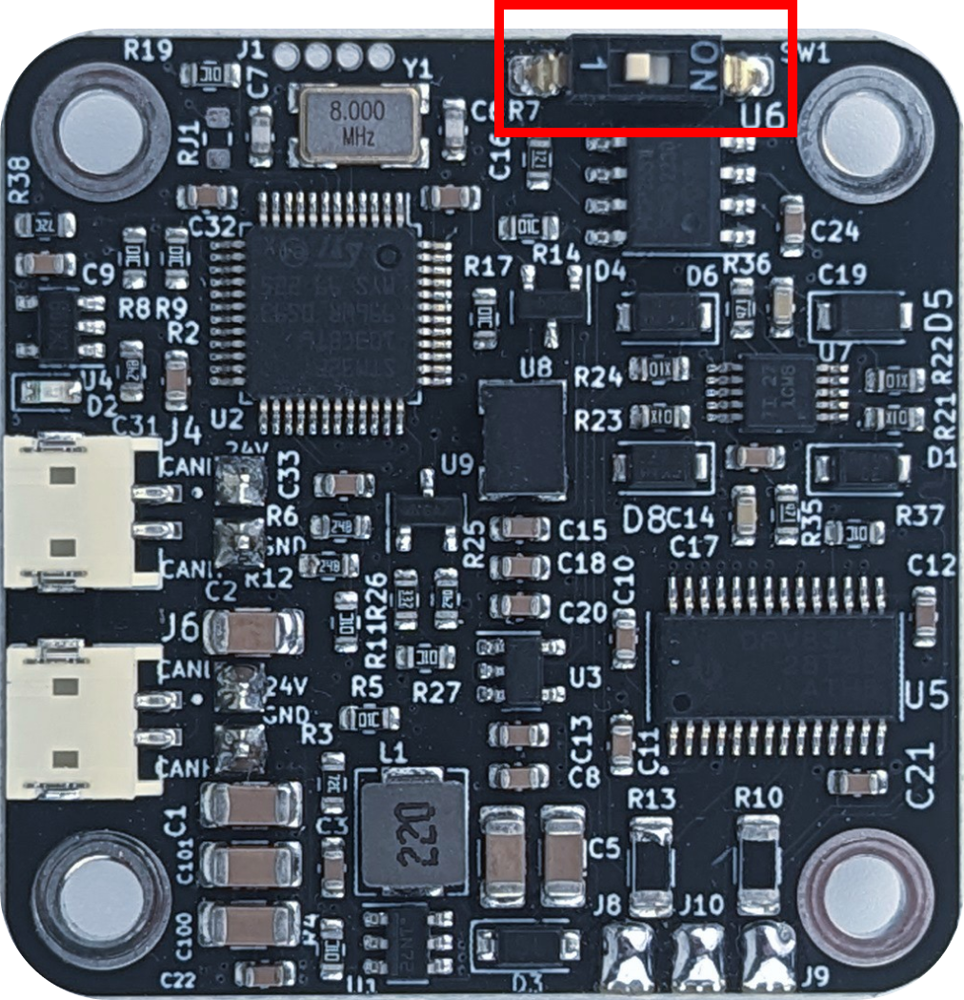

# Spectral micro datasheet

!!! Note annotate "" 
**Spectral Micro** is a brushless motor controller designed to offer affordable and capable hardware, complemented by **open-source** software. It supports multiple firmware options and integrates a 14-bit magnetic encoder, inline current sensing, CAN and UART data interface, and provides support for position, velocity, torque, and impedance control.   Everything you need for developing high-performance robotic solutions is included.   
It is ideal for **gimbal motors**, **quadrupeds**, **robotic arms**, and **grippers**. Check the list of tested motors here!

   |   |   Features
    ---- | ---- 
    
    
 | **Electrical specs**    - 3 phase brushless FOC controller    - Voltage input: 12 - 29V      - Max continuous phase current: 2.8A    - Max phase current: 2.8A (with good colling)    - Inline current sensing    - PWM switching rate: 25 kHz    - Max power: 80W     - Idle power: 0.3W    - Control loop frequency: 5kHz      - Max electrical frequency: 460 Hz        **Mechanical specs**     - Mass: 8 g      - Dimensions: 39mm x 39mm    - Nema 17 compatible mounting hole distances      **Features**  - STM32f103c microcontroller  - 14 bit encoder    - CAN and UART communication   -  Daisy chain CAN and power connector     - EEPROM memory 16 Kbit    -  Hardware overcurrent, over-under voltage and temperature protection     - Fully open source firmware and support for SimpleFOC    - One additional pin analog input, digital input or output    - Temperature sensor connector   -  Torque, velocity, position, and Impedance control modes   -  Auto calibration features 
  

!!! Tip annotate "Each spectral micro BLDC controller is Fully end of line tested." 

!!! Note annotate "" 

## **Absolute maximum ratings**

* Supply voltage -> min 10V, typ 24V, max 29V
* Phase current -> typ 1.5A, max 2.8A
* Operating Temperature -> min -20°C, typ 25°C, max 130°C

Hardware level protection circuits and limits:

* Overcurrent protection trip level -> min 3A typ 5A
* VM undervoltage lockout voltage -> typ 6.3V  MAX 8v
* Thermal shutdown temperature -> min 150 deg, typ 160, max 180

!!! Note annotate "" 

## **Connectors**

Connector | Cable assembly | Connector datasheet
---- | ---- | ----
UART| [Link](https://source-robotics.com/products/uart-cable) | [JST SH series](https://www.digikey.com/en/product-highlight/j/jst/sh-and-sr-series-connectors)
Power| [Link](https://source-robotics.com/products/spectral-micro-power-cable) | [JST XH series](https://www.digikey.com/en/product-highlight/j/jst/xh-series-connectors)
CAN| [Link](https://source-robotics.com/products/spectral-micro-can-cable?variant=47694678655324) | [JST ZH series](https://www.digikey.com/en/products/detail/jst-sales-america-inc/ZHR-2/566476)
JTAG| [Link](https://source-robotics.com/products/jtag-programming-adapter-1-27-pitch?variant=47293352903004) | 1.27 pitch pin header

!!! Note annotate "" 

## **Pinout**

!!! Tip annotate "REVERSING POLARITIY ON DC+- WILL DESTROY YOUR BOARD." 

Motor phases are conneceted to U,V and W. Power is connected to DC+ and DC-

    

    

!!! Note annotate "Note!" 

    * to enable hal you need to solder 12 10k reistors above HAL connecor
    * termistor pin is using pulldown of 54.9 kilo ohms. 
    * UART is 3v3 only. Using 5V will destroy the board.
    * "PIN" can be used as analog input or general purpose input/output

!!! Note annotate "" 

## **CAD and dimensions**

[You can download Spectral micro STEP files here!](https://github.com/PCrnjak/Spectral-Micro-BLDC-controller/tree/main/STEP%20files)

    

Spectral micro uses same hole spacing as NEMA17 format motors.
!!! Note annotate "Magnetic encoder is located exactly at the middle of the board!" 

    

!!! Note annotate "" 

## **CAN termination**

To use CAN termination make sure to place the swith in **ON** position!

    

!!! Note annotate "" 

## **Pre loaded firmware**

!!! Note annotate "" 
    **Spectral micro comes preloaded with spectral firmware. You can check what release by using UART interface and calling the command: #Info**

Default settings that come prelaoded are:

- LED indication: 1  
- Calibrated: 0
- Using termistor: 0
- Watchdog active: 0
- Heartbeat active: 0
- UART baud rate: 256000
- CAN baud rate: 1000000
- Default CAN node ID: 0
- I AM GRIPPER: 0
