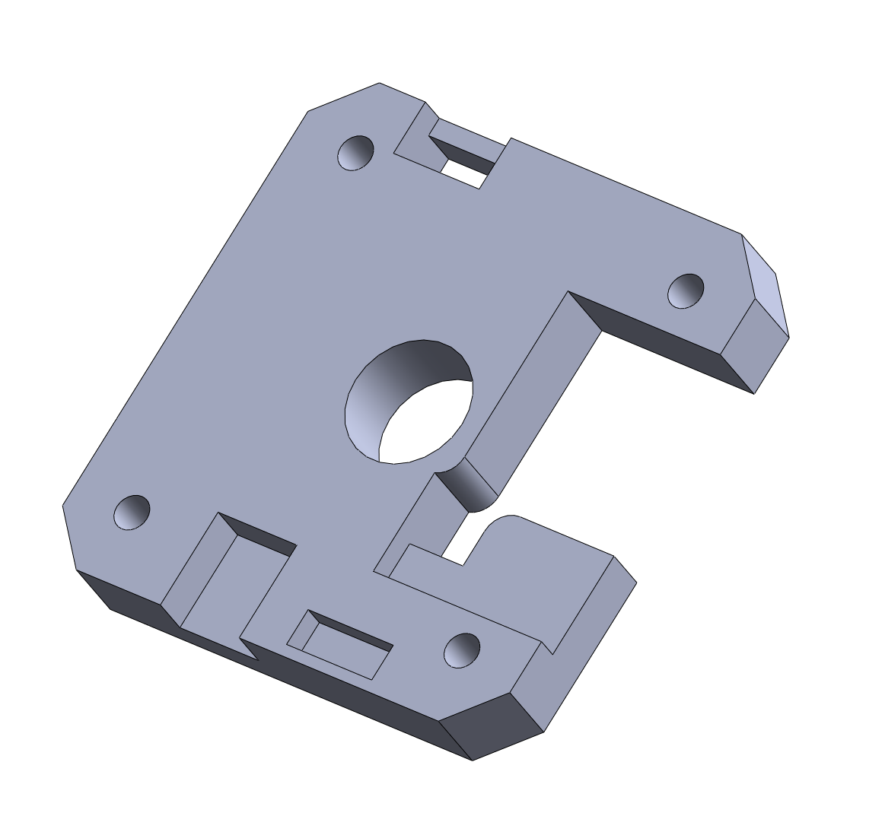
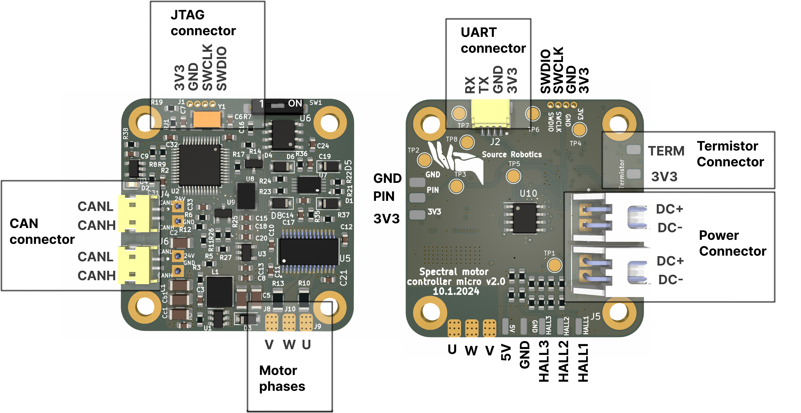
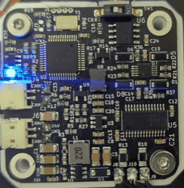

# Getting started

## **Recommended hardware**

1. [Diametrically magnetized magnet]()
2. BLDC motor; check [here]() for all tested motors
3. [Programming adapter](https://source-robotics.com/products/jtag-programming-adapter-1-27-pitch)
4. [Serial adapter]()
5. [CAN adapter](https://source-robotics.com/products/canvas-usb-to-can-adapter) 
6. [Termistor]()
7. [CAN wires](https://source-robotics.com/products/spectral-micro-can-cable) and [power wires](https://source-robotics.com/products/spectral-micro-power-cable)

## **Hardware setup**

### **Mounting PCB to Motor**

To mount your BLDC to PCB you can use [example motor bracket](https://github.com/PCrnjak/Spectral-Micro-BLDC-controller/tree/main/STEP%20files) and modify it for your motor. 

    

Some hardware considerations:

* Distance between motor encoder and magnet should be around 1 mm.
* Hole spacing of Spectral micro is 31 mm

    

## **Electrical connections**
!!! Danger annotate "REVERSING POLARITIY ON DC+- WILL DESTROY YOUR BOARD." 

    

1. Solder motor phases to **U,W,V**
2. Connect motor power to one of the **Power connectors** terminals
3. If you are using UART comms. Connect Uart adapter to **UART connector**
4. If you are using termistor, connect it to **Termistor connecor**
5. If you are using CAN comms. Connect CAN adapter to one of **CAN connectors**
6. When uploading code connect JTAG adapter to **JTAG connector**

## **Connecting multiple motors (daisy chaining)**

Multiple Spectral BLDC drivers and nodes can be connected to single CAN bus using daisy-chaining. First an last nodes on can bus should have termination resistors. On Spectral micro you can flip the CAN switch to "ON" positon to enable termination resistor.

!!! Tip annotate "Power connectors can handle max 4 A DC. Usually if you are using 10ohm gimbal motor you can daisy chain 3-4 of them." 

    
 

## **Status**
Normal operation | Calibration | Error mode 
---- | ---- | ----
3 short flashed and a pause 
    
 | Flashing every 0.5 seconds 
    
 | Solid LED, no flashing. 
    

If you have [spectral firmware](https://github.com/PCrnjak/Spectral-Micro-BLDC-controller/tree/main/Spectral%20BLDC%20Firmware) uploaded on your spectral BLDC LEDs will be in one of 3 states.

* **Normal operation** is when motor controller has no active errors and is calibrated
* **Error mode** is active if any error on the motor driver is active. List of possible errors:
    1. Temperature error
    2. Drv error
    3. Encoder error
    4. Vbus error
    5. Velocity error
    6. Current error
    7. Not calibrated 
    8. Received ESTOP
    9. Watchdog error
* **Calibration** will flash when in calibration routine

