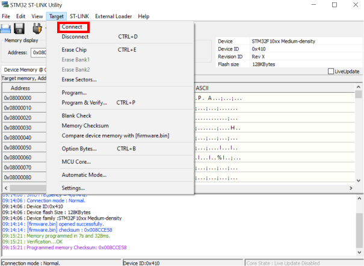

# Flashing firmware

!!! Tip annotate "Note" 
    When flashing new firmware make sure you disconnect power connection and uart connection.

   |   |   Needed hardware
    ---- | ---- 
    You can change all variables using UART and CAN so flashing firmware a lot is not necessary  You will usually flash it when:   1. New version of Spectral BLDC firmware is available  2. You are doing custom code developement   3. You are using SimpleFOC firmware | You will need programming adapter from [here!](https://source-robotics.com/products/jtag-programming-adapter-1-27-pitch?variant=47293352903004) 
    

## **Connecting to PCB**

=== "Using [Adapter](https://source-robotics.com/products/jtag-programming-adapter-1-27-pitch?variant=47293352903004) "

    Step 1 | Step 2
    ---- | ---- 
    Locate JTAG PINS | Press programming adapter like shown in the picture (apply small amount of pressure on the pins to get a good contact)
    
    
 | 
    
 

## **Flashing using visual studio code**
Download visual studio code: [Link](https://code.visualstudio.com/download) 

1. Open [Spectral BLDC firmware](https://github.com/PCrnjak/Spectral-Micro-BLDC-controller/tree/main/Spectral%20BLDC%20Firmware) folder in VS code. (You need to have platformio installed)
2. Press uplaod in VS code (Bottom left corner in VS code)

    

## **Flashing using STM32 ST-LINK Utility**
Download STM32 ST-LINK utility [Link](https://www.st.com/en/development-tools/stsw-link004.html)

!!! Note annotate "HEX and binaries" 
    Using STM32 ST-LINK Utility you can flash only Binary or HEX files. These can be obtained from compiling source code of spectral BLDC firmware

**Open STM32 ST-LINK utility Drag and drop the [binary file](https://github.com/PCrnjak/Spectral-Micro-BLDC-controller/tree/main/Binaries) inside.**

    

**Go to Target/settings and make sure they look like this.**

    

**Go to Target/connect. In case you get a error try to install stlink drivers from [here!](https://www.st.com/en/development-tools/stsw-link009.html)**

    

**Go to Target/program and verify. You should get pink output msg like below.**

    

