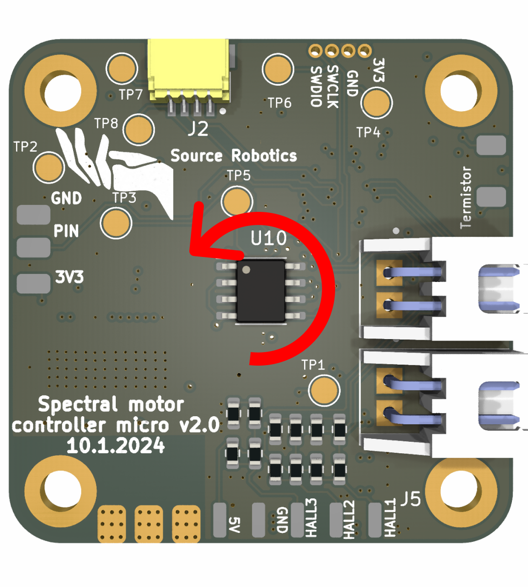

# Calibration

Spectral firmware has autocalibration feature that allows you to automatically detect and tune your motor parameters. It detects the following:

* Motor phase resistance 
* Motor phase inductance
* Motor pole pair
* Motor phase order **Currently has a bug and requires some manual adjustment**
* Current loop PID parameters

!!! Tip annotate "Vbus voltage" 
    When calibrating the motor use 24V supply voltage for the best results! 
    Using smaller voltage may result in incorrect Resistance, inductance and kt and other parameters!

## **Positive rotation**

!!! Tip annotate "In spectral firmware positive rotation is always counter-clockwise. That means that positive current will result in rotation in that direction. Positive speed setpoint will rotate motor in that direction and rotating in that direction will increase motor positon!" 

    

## **Default calibration settings**
Calibration default setting are: 

* **Current loop bandwidth: 100.00Hz** -> Used to calculate current loop PI parameters, setting this too high will result in vibrating motor and audiable noise
* **Resistance voltage: 1000mV**  -> We start to measure resistance at this voltage and increase it until power dissipation reaches the "Max Power dissipation" parameter below
* **Max Power dissipation: 12.00W** -> Used for resistance measure and as a maximum that we can dissipate when calculating inductance
* **Open loop voltage: 5000mV** -> What voltage we will use for open loop control (used to calculate Pole pairs)       
* **Open loop Speed: 20.00Rad/s** -> Electrical speed we will use for open loop (used to calculate Pole pairs)     
* **Phase search voltage: 500** -> Used when spinning the motor to find correct phase order

These generic parameters will work for motor with resistances ranging from 2 - 24 ohms.

!!! Danger annotate "Danger" 
    Using these settings on motors with lower resistance (for example Drone BLDC motors) can be destructive for Spectral BLDC driver.

!!! Note annotate "Note" 
    Resistance and inductance values returned from calibration will have variations and are just estimates of real values.

Note that the values that Spectral drives calculate are only estimations and if you want to get exact values use high precision insturments to measure them.

## **Calling calibration routine**

Calibration routine can only be called from the UART interface. The command is: 

    #Cal

## **Calibration routine output**

!!! Note annotate "Note" 
    Values that our calibration routine returns here are specific to motor we tested. Your numbers WILL be different!

!!! Tip annotate "Tip" 
    In case your motor stays in one step of the calibration routine too long issues a #reset command and try again. Also do that in case you dont get full log messages from the routine.

After calling calibration routine the following will happen:

**Window with default calibration settings** 
These are the setting that will be used for calibration

    Calibration mode
    -----Settings-----
    Current loop bandwidth: 100.00Hz 
    Resistance voltage: 1000mV       
    Max Power dissipation: 12.00W    
    Open loop voltage: 5000mV        
    Open loop Speed: 20.00Rad/s      
    Phase search voltage: 500

**Magnet and Vbus check** 
Motor will check Vbus voltage and try to  detect Encoder magnet. If both passed you will get:

    Magnet test: Passed
    Vbus test: Passed
!!! Danger annotate "Even if the magnet test "passed" your magnet could still be too far or to close (touching) the encoder IC. You need to make sure that distance between the magnet and the IC is 1mm."

**Resistance and inductance measurement** 
In the this step motor will start to produce clicking sounds, by doing that it will measure resistance and inductance. 
The output will be as follows:

    Resistance = 7.026575Ohm
    Inductance = 0.001492H
    Kp_iq = 1.288308
    Ki_iq = 0.630704

Motor will also calculate Kp_iq and Ki_iq using measured resistance, inductance and given current loop bandwidth.

**Pole pair check** 
Motor will spin in one direction to check the number of pole pairs.
Output will look like this:

    Pole pair = 11

**Phase order dir** 
Motor will start to spin in both directions. 
Good output will look like this:

    Phase order = 2
    Phase order is good!

In case you get:

    Phase order = 0 
    Phase order is wrong!
    Switch motor phases and try again!
    Calibration failed!

Power off the motor and switch any 2 motor phases. Re run the calibration.
If you get the same error again switch motor phases again until you get:

    Phase order is good!

**Kt, KV and flux linkage dir** 
Motor will start to spin fast in one direction for a short time. 
Good output will look like this (Your numbers will be different):

    KV is: 39.41667 
    Kt is: 0.20981
    Flux linkage is: 0.012716 

!!! Note annotate "Errors" 
    Note that in this step we measure motor KV and from that Kt and flux linkage. KV measurement can be wrong due the a lot of factors 
    and for cheap and poor quality motors you can get different results in by 2-3 times magnitude. 

**Calibration end** 
In case your calibration was succesful you will get message like below. Make sure to save the config.
After the successful config is saved you dont need to re run calibration when you start your motor driver.

    Calibration success!
    Save config with #Save
    Going to idle!

!!! Note annotate "Note" 
    You will need to re run the calibration if you change your motors or change motor phases.

!!! Danger annotate "False success!" 
    There is a known issue related to the encoder magnet's attachment to the motor rotor. If the magnet is not securely fastened and can slip or rotate freely, the motor may incorrectly report that the calibration process was successful when, in fact, it was not. To avoid this problem, it's crucial to ensure that the magnet is firmly secured to the motor rotor. Proper attachment of the magnet ensures the accuracy of the calibration process and prevents potential errors in motor operation.

## **Troubleshooting**

No magnet detected

    Magnet test: Failed 

Vbus to low or not detected

    Vbus test: Failed

Motor is not connected or damaged

    Resistance test: Failed 

Wrong phase order. Switch motor phases

    Phase order is wrong!
    Switch motor phases and try again!
    Calibration failed!

