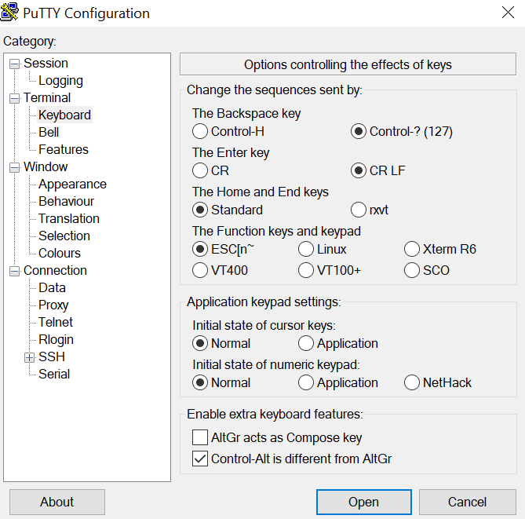
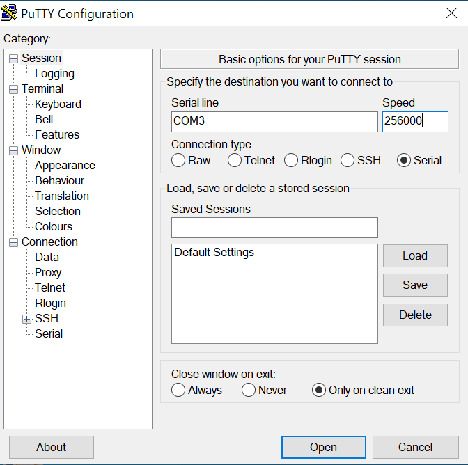
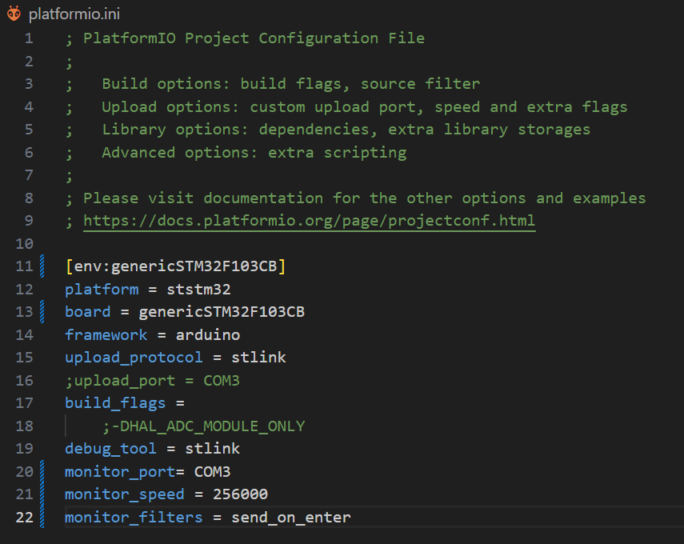
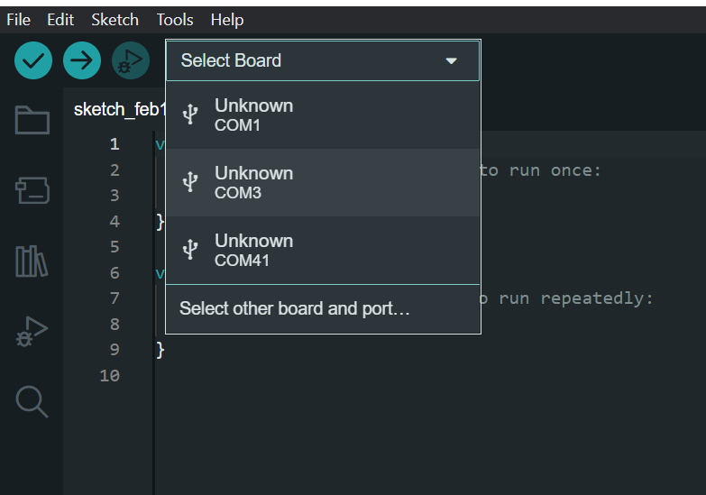
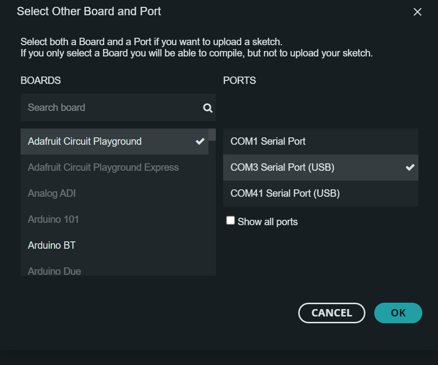
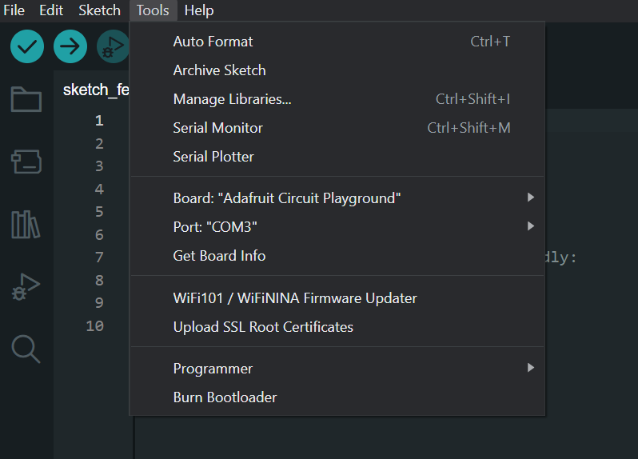

# UART interface

The UART interface is more interactive and user-friendly compared to CAN. With just a serial monitor and a USB-to-serial device, you can communicate with your motor and receive interactive, human-readable responses.

Disadvantages: 

* Passing human-readable data is slow and limiting if you aim for high-performance control.
* Only one device per UART channel, so no daisy chaining.
* Susceptible to noise.

Default baud rate is: 256000 (Max tested baudrate is 1000 0000)

!!! Note annotate "" 

## **How to connect**
* TODO how to connect to serial adapter

!!! Danger annotate "Voltage warrning" 
    Spectral micro UART port uses 3.3 volts. Using 5V will destroy your board!

    

!!! Note annotate "UART pins" 
    Take note that UART is connected TX to RX and RX to TX

!!! Note annotate "" 

## **Using serial monitor**

=== "Putty"
    **Download Putty from this link: [Modified Putty](https://www.grzegorz.net/pliki/putty-crlf.zip)**

    !!! Note annotate "Note" 
        You need to have Putty from above link to add CR LF option. Stock Putty cant do that!

    Step 1 | Step 2
    ---- | ---- 
    Go to keyboard tab and Select CR LF option | Enter serial port of your adapter and enter speed; Click Open 
    
    
 | 
    

=== "VScode"
    **Download VScode from this link: [VS code](https://code.visualstudio.com/download)**
    Open Spectral firmware in VS code (You will need to install Platformio extension)

    Step 1 | Step 2 
    ---- | ---- 
    Made sure your platformio.ini file looks like this (usually platformio will auto detect the COM port) | Click the icon marked in red and that will open a serial terminal
    
    
 | 
    
  
    

    

=== "Arduino"
    **Download Arduino from this link: [Arduino](https://www.arduino.cc/en/software)**

    Select matching COM port of your serial adapter
    
    

    For boards we usually select "Adafruit Circuit Playground"
    
    

    In tools tab press Serial monitor
    
    

!!! Note annotate "" 

## **UART protocol**

All commands need to start with # and end with CR + LF (carriage return \r + Newline (Line Feed) \n). 

!!! Note annotate "CR + LF" 
    Usually CR + LF is inserted by the terminal you use when you press enter.

All commands are response-only; that means the motor driver will never send data over UART unless it receives a request from the host.

!!! Note annotate "Cyclic commands" 
    Only exceptions are cyclic commands that allow you to set up motor driver to periodically send some data.

Aftter **#** You can enter your command. For example: #Error 
 Commands that are type **`set/get`** can have a number argument after command name. Number argument for command can be one of following types as described in table column "Input Data type"

* int - positive and negative integer values
* float - positive and negative float values
* bool - 0 or 1

Commands and numbers need to be seperated by a single space! Example: #LED 1

!!! Note annotate "Commands are case sensitive!" 
    Command names are case sensitive and need to be same as in the table to be registred.

Template of command: 
`#Name number`

Here are few examples:

* Calling `#P 100` will set our motor to positon mode with setpoint of 100 and return its current position, but calling `#P` will only return current positon of the motor.
* Calling `#V 1000` will set motor to velocity mode with setpoint of 100 and return its current velocity, but calling `#V` will only return current velocity of the motor.
* Calling `#LED 1` will enable led indication on the motor and `#LED 0` will disable it; also both examples wilL return its current status. Calling only `#LED` will tell us the current status. 

As you can see Responses of Set/Get  commands do not change if they have number command after command name. So calling `#P` and `#P 100` will have same response; defined in Response tab of the table.

!!! Tip annotate "**Action commands**" 
    **Commands of type `action` do not take any second arguments.**  

**Cyclic  commands:** 
There are few cyclic commands available. they initiate a motor to send data every timeinterval we set.

1. `Cyc`
2. `Cyca`

!!! Note annotate "" 

## **List of commands**

### **Motion commands**
 Name | Type | Input Data type | Desciption | Response
---- | ---- | ---- | ---- | ----
`Iq` | Set/Get | float | `Switches actuator to current control mode and sets current setpoint to Iq value.` |   Iq value [mA] 
`V` | Set/Get | int | `Switches actuator to velocity control mode and sets velocity to setpoint V` |   Velocity value [Encoder ticks/s]  
`P` | Set/Get | int | `Switches actuator to position mode and sets positon setopint to P value` |   Position [Encoder ticks]
`PD` | Set/Get | int | `Switches actuator to Impedance PD control mode and sets position setpoint to PD value` |  Current position [Encoder ticks]
`PDV` | Set/Get | int | `Set/Get velocity setpoint when in Impedance PD mode.`  |  Current velocity setpoint when in PD mode 
`PDI` | Set/Get | int | `Set/Get current setpoint when in Impedance PD mode` |  Current current setpoint when in PD mode
`Openloop` | Set/Get | int | `Enter open loop mode and spin with speed; Example #Openloop 1000; Motor will use voltage preset given by #Openv command` | Value of open-loop speed

### **PID tuning commands**
 Name | Type | Input Data type |  Desciption | Response
---- | ---- | ---- | ---- | ----
`Kpp` | Set/Get | float | `Set/Get position loop Kp gain` |  Current value of Kpp
`Kpv` | Set/Get | float | `Set/Get velocity loop Kp gain` |  Current value of Kpv
`Kiv` | Set/Get | float | `Set/Get velocity loop Ki gain` |  Current value of Kiv
`Kpiq` | Set/Get | float | `Set/Get current loop Kp gain (Iq and Id loop)`  |  Current value of Kpiq
`Kiiq` | Set/Get | float | `Set/Get current loop Ki gain (Iq and Id loop)`  |  Current value of Kiiq
`Kpid` | Set/Get | float | `Set/Get Id current loop Kp gain.` |  Current value of Kpid
`Kiid` | Set/Get | float | `Set/Get Id current loop Ki gain.`  |  Current value of Kiid
`Vlimit` | Set/Get | int | `Clamp velocity integrator to the value of Vlimit` | Current value of Vlimit [Encoder ticks/s] 
`Ilim` | Set/Get | int | `Set/Get Iq current limit`  | Current value of Ilim [mA]
`Id` | Set/Get | float | `Set/Get the value of Id setpoint. Usually we do not touch this and should stay at 0` |   Id value [mA] 
`KP` | Set/Get | float | `Set/Get KP of impedance PD loop` |  Current value of KP 
`KD` | Set/Get | float | `Set/Get KD of impedance PD loop` |  Current value of KD
`Rstint` | Set/Get | bool | `Set/Get do we want to reset integral accumulators after receiving new setopint, default is 0.` | 0 if disabled 1 if enabled

### **Calibration and motor parameter commands**
 Name | Type | Input Data type | Desciption | Response
---- | ---- | ---- | ---- | ----
`Cal` | Action |  | `Start motor calibration procedure` |
`R` | Set/Get | float | `Set/Get phase Resistance` |   Phase Resistance [Ohm]
`L` | Set/Get | float | `Set/Get phase Inductance` |   Phase Inductance [Ohm]
`PP` | Set/Get | int | `Set/get Number of POLE PAIRS!` | Current nomber of pole pairs
`Kt` | Set/Get | float | `Set/Get Kt (Torque constant)` |  Current value of Kt
`KV` | Set/Get | float | `Set/Get KV (motor velocity constant)`  |  Current value of KV
`Flux` | Set/Get | float | `Set/Get flux linkage` |  Current flux linkage value 
`Magnet` | Action |  | `Gets magnet status` | Good or Bad
`Dir` | Set/Get | bool | `Set/Get Dir` | Current value of Dir
`Phase` | Set/Get | int | `Set/Get Phase order` | Current value of Phase order
`Cbw` | Set/Get | int | `Set/Get current loop bandwidth [Hz]` | Current current loop bandwidth
`Resv` | Set/Get | int | `Set/Get voltage used when looking for resistance value (Used in #Cal function)` | Current voltage used when looking for resistance
`Calpwr` | Set/Get | int | `Set/Get max power that can be used during Inductance and resistance search (Used in #Cal function)` | Current calibration power
`Openv` | Set/Get | int | `Set/Get voltage used during open loop operation (Used in #Cal function and when using #Openloop)` | Current open loop voltage
`Opens` | Set/Get | int | `Set/Get open loop calibration speed (Used in #Cal function)` | Current open loop calibration speed 
`Vp` | Set/Get | int | `Set/Get phase order search voltage (Used in #Cal function)`

### **Utility commands**
 Name | Type | Input Data type | Desciption | Response
---- | ---- | ---- | ---- | ----
`Idle` | Action |  | `Set motor to idle state` | 
`Save` | Action |  | `Save current config to EEPROM` |
`LED` | Set/Get | bool | `Enable disable LED status` | Current status of LED indication; 0 is off, 1 is on
`Reset` | Action |  | `Reset the MCU` |
`Default` | Action |  | `Load default config to EEPROM` | **Note this will rewrite all data saved in eeprom (including serial number, hardware version, batch date...) Before using it make sure to manually backup any important data. 
`Temp` | Action |  | `Get termistor temperature in degrees` | Temperature in degrees
`Term` | Set/Get |bool | `Enable/disable termistor mesurment `| 0 disabled 1 enabled
`Tlim` | Set/Get |int | `Set/Get the temperature at which thermal error will trigger`| Be careful here value of 75 is default and it is not recommended to go higher than that unless you know you motor is rated for more
`Mode` | Action |  | `Get current operating mode` | Operating mode (Open loop, Idle, Positon control...)
`Vbus` | Action |  | `Get current value of Vbus` | current value of Vbus [mV]
`Error` | Action |  | `Get current state of all errors` | List of errors
`Clear` | Action |  | `Clear all errors and go to idle; *NOTE: this will not clear calibration error if drive is not calibrated. `
`Iabs` | Action |  | `Get value of motor phase currents` | value of phase currents [mA]
`Close` | Action |  | `Enter closed loop mode` | 
`PWM` | Action |  | `Get value of PWM values` | Current PWM values
`Info` | Action |  | `Get Information about motor driver and motor` | Motor information
`Param` | Action |  | `Get all currently set PID parameters for every control mode` | PID parameters
`Cyc` | Set/Get | int | `Periodically send messages`
`Cyca` | Set/Get | int | `Periodically send messages arduino format`
`CANID` | Set/Get | int | `Set/Get CAN ID (can be from 0 - 15)` | Current CAN node ID 
`SERNUM` | Set/Get | int | `Set/Get motor controller serial number`  | Current serial number of motor controller
`Calibrated` | Set/Get | bool | `Set/Get motor calibration status. *NOTE: calling #Calibrated 1 will set controllers calibration status to 1 but motor controller might not be properly calibrated. To run auto calibration run #Cal command` | Calibrated or not calibrated
`Activate` | Set/Get | bool | `Activate the motor (Not used in this version of code)` |
`Pullconfig`| Action |  | `Prints all motor data over serial; used for updating the Spectral motor GUI` | Motor data seperated by single space char

### **Gripper commands**
Commands used when in gripper mode. Procedure: 

* Gripper 1 (Tells our motor controller we are using it as gripper)
* Gripcal (this will calibrate the gripper)
* Gripvel x (x is value from 0 - 255; 0 being min speed 255 max speed)
* Gripcur x (x is value from 0 - 1000 [mA])
* Grippos x (x is vale from 0 - 255; 0 being fully open 255 fully closed)

 Name | Type | Input Data type | Desciption | Response
---- | ---- | ---- | ---- | ----
`Gripper` | Set/Get | bool | `Set/get Am I a gripper` | Is this device gripper or not
`Gripcal` | Action |  | `Start gripper calibration` |   None
`Grippos` | Set/Get | uint8_t | `Set/get desired gripper setpoint position (from 0 to 255). Also will set gripper into GOTO mode and execute the command` | Gripper positon value
`Gripvel` | Set/Get | uint8_t | `Set/get desired gripper velocity setpoint (from 0 to 255)` | Gripper velocity value setpoint
`Gripcur` | Set/Get | int | `Set/get desired gripper current in mA from 0 - 1000 (Note value below 150 are unstable)` | Gripper current value setpoint; to get current current value use #Iq
`Gripact` | Set/Get | bool | `Set/get gripper activation bit` | Is gripper activated or not
`Gripstop` | Set/Get | bool | `Set/get gripper Estop bit` | Gripper estop bit status
`Gripinfo` | Action |  | `Print information about this gripper` | All information about gripper like: is it calibrated, status, endstop values...

!!! Note annotate "" 

## **Cyclic commands**
TODO