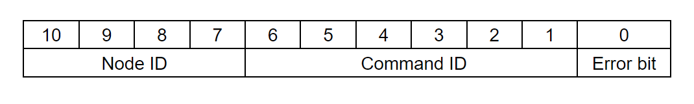

# CAN interface

!!! Note annotate "" 

**CAN bus** should be your primary choice when developing robotic aplication.  
Spectral micro uses 5V CAN bus that adheres to the CAN 2.0 standard. Each Spectral micro has 2 CAN bus connectors allowing you to easily daisy chain multiple devices. 

    

Bits **10 - 7** of CAN ID represent Node ID.  
Node IDs can range from 0 - 15 Meaning you can have maximum 16 different devices on one CAN bus. 

Bits **6 - 1** of the CAN ID represent Command ID. 
Command IDs can range from 0 - 63.

Bit **0** represents error bit. If spectral micro BLDC controller has any active error this bit will be set to 1. Note this bit is send always by the driver and is independent about the command ID and data.

Node with smallest Node ID is strongest in CAN bus arbitration.

**If you want to learn more about CAN bus we recommend you read this [article!]()**

**This page describes can protocol; Go to [CAN bus guide](https://source-robotics.github.io/Spectral-BLDC-docs/Guides/CAN%20bus%20guide/) for hardware setup and examples**  
**You can use our [Python CAN bus API](https://github.com/PCrnjak/Spectral-BLDC-Python/tree/main) to communicate with your Spectral BLDC controllers!**  
**If you want to se more examples on how to write Python scripts to control your motor over CAN [check this guide!](https://source-robotics.github.io/Spectral-BLDC-docs/Guides/Python%20guide/)**

!!! Note annotate "" 

## **List of commands**

!!! Tip annotate "**Messages prefixed with Send are messages that the host can send to the Spectral BLDC controller. Note that to some of these messages the driver will respond with pre-defined message prefixed with Respond**" 
!!! Note annotate "**Messages prefixed with Respond  are messages that the Spectral BLDC controller can send to the host.**" 
!!! Danger annotate "**Messages prefixed with Send_Respond are messages that host can request from BLDC controller and it will respond with the desired data packet with the same Command ID as recived command. Host is sending these msgs with RTR bit and Spectral is responding with RTR 0 and some data packet.**" 

 Command ID | Name | Type | Data 
---- | ---- | ---- | ---- 
9 | `Respond_Heartbeat` | Respond | None 
3 | `Respond_data_pack_1` | Respond | Position [Encoder ticks]   Velocity [Encoder ticks/s]   Current [mA]
5 | `Respond_data_pack_2` | Respond | Data 
7 | `Respond_data_pack_3`| Respond | Data 
60 | `Respond_Gripper_data_pack` | Respond | Position    Current   Gripper activation status   Gripper action status   Object detection status    Temperature error   Timeour error   Estop error   Calibration status

 Command ID | Name | Type | Data 
---- | ---- | ---- | ----
2 | `Send_data_pack_1` | Send | Position [Encoder ticks]   Velocity [Encoder ticks/s]   Current [mA]
6 | `Send_data_pack_2` | Send | Data
8 | `Send_data_pack_3` | Send | Data
4 | `Send_data_pack_PD` | Send  |Position [Encoder ticks]   Velocity [Encoder ticks/s]   Current [mA]
61 | `Send_gripper_data_pack` | Send | Position    Velocity    Current [mA]    Gripper activation    Gripper action   Estop status   Release direction
62 | `Send_gripper_calibrate` | Send | None
16 | `Send_PD_Gains` | Send | KP   KD
17 | `Send_Current_Gains` | Send | Kpiq   Kiiq 
18  | `Send_Velocity_Gains` | Send |Kpv   Kiv 
19 | `Send_Position_Gains` | Send | Kpp
20 | `Send_Limits` | Send | Velocity limit   Current limit
22 | `Send_Kt` | Send | Kt 
11 | `Send_CAN_ID` | Send | CAN ID
0 | `Send_ESTOP` | Send | None
12 | `Send_Idle` | Send | None
13 | `Send_Save_config` | Send | None
14 | `Send_Reset` | Send | None
1 | `Send_Clear_Error` | Send | None
15 | `Send_Watchdog` | Send | Time   Action
30 | `Send_Heartbeat_Setup` | Send | Time
29 | `Send_Cyclic_command` | Send | Data

 Command ID | Name | Type | Respond data 
---- | ---- | ----  | ---- 
23 |`Send_Respond_Temperature` | Send/Respond | Temperature
24 |`Send_Respond_Voltage` | Send/Respond | Vbus voltage
25 |`Send_Respond_Device_Info` | Send/Respond | Serial number   Hardware version   Batch date   software version
26 |`Send_Respond_State_of_Errors` | Send/Respond | Error   Temperature error   Encoder error   Vbus error   Driver error   Velocity error   Current error   ESTOP error   Calibration status   Activated status   Watchdog error 
27 |`Send_Respond_Iq_data` | Send/Respond | Iq current
28 |`Send_Respond_Encoder_data` | Send/Respond | Position [Encoder ticks]   Velocity [Encoder ticks/s]
10 |`Send_Respond_Ping` | Send/Respond | None

!!! Note annotate "" 

## **Watchdog**

**By default watchdog is turned off.** 
Each valid CAN message received by the spectral BLDC resets its watchdog timer. 
Watchdog measures time between the commands that spectral BLDC receives. 
If it is bigger than time you set it will report Watchdog error and go to error mode.
To clear the error you will need to call:

    "Send_Clear_Error"

!!! Note annotate "" 

## **Heartbeat**
**By default heartbeat will send data at 1Hz or every 1 second.** 
Hearbeat is function that will Send "Respond_Heartbeat" msg every time interval you set in "Send_Heartbeat_Setup".  
This is usefull when your host device needs to see if spectral BLDC is connected/alive.  
In case your spectral BLDC sends any other data (as a response to command) it will reset its heartbeat timer.

!!! Tip annotate "**Heartbeat timer reset**" 
    For example if spectral BLDC is sending data every 10ms and heartbeat is setup to send every 1s; hearbeat will never send its data. 

!!! Note annotate "" 

## **Cyclic**
**TODO**

!!! Note annotate "" 

## **Commands**

### **Respond_Heartbeat**

!!! Note annotate "" 

This is the command that driver will send as its heartbeat every X ms. It is an empty data frame. 

* Command ID: 9  
* Direction: BLDC driver -> host  
* Python call: None, this command is sent only by driver  
* Length: 0 byte 
* Type of frame: standard 

---

### **Respond_data_pack_1**

!!! Note annotate "" 

This is the command that driver will send as a response to movement commands like Send_data_pack_1 and Send_data_pack_PD.  

* Command ID: 3  
* Direction: BLDC driver -> host  
* Python call: None, this command is sent only by driver  
* Length: 8 byte 
* Type of frame: standard  

Size (bytes) | Variable (Spectral_BLDC Lib python attribute)  | Type | Details
---- | ---- | ---- | ---- 
0 - 2 | position | signed 24bit | unit is encoder ticks
3 - 5 | velocity | signed 24bit  | unit is encoder ticks /s
6 - 7 | current | signed 16bit  | unit is mA

---

### **Respond_Gripper_data_pack**

!!! Note annotate "" 

This is the command that driver will send as a response to Send_gripper_data_pack.  

* Command ID: 60  
* Direction: BLDC driver -> host  
* Python call: None, this command is sent only by driver  
* Length: 4 byte  
* Type of frame: standard  

Size (bytes) | Variable (Spectral_BLDC Lib python attribute)  | Type | Details
---- | ---- | ---- | ----
0  | gripper_position | unsigned 8bit | 255 fully closed, 0 fully open
1-2 | gripper_current |  16 bit signed | 0 min current, 1300 max current, unit mA
3(bit 0) | gripper_activated | bit (0/1) | gripper activate (1) / deactivated (0)
3(bit 1) | gripper_action_status | bit (0/1) |  1 is goto, 0 is idle or performing auto release or in calibration
3(bit 2 and 3) | gripper_object_detection | 2 bit | 0 in motion, 1 object detected closing, 2 object detected opening, 3 at positon
3(bit 4) | gripper_temperature_error | bit (0/1) | gripper_temperature_error
3(bit 5) | gripper_timeout_error | bit (0/1) | gripper_timeout_error
3(bit 6) | gripper_estop_error | bit (0/1) | gripper_estop_error
3(bit 7) | gripper_calibrated | bit (0/1) | gripper calibration status; calibrated (1) / not calibrated (0)

---

### **Send_data_pack_1**

!!! Note annotate "" 

This command will place the driver in position, speed or current control mode depending on the amount of paramters you give it. 
Note that if you dont want feedforward just set it to 0. 

* Command ID: 2  
* Direction: Host -> BLDC driver  
* Python call: Send_data_pack_1()  
* Type of frame: standard  
* Lenght: 8 byte -  If using positon setpoint with speed and current feedforward

Size (bytes) | Variable | Type | Details
---- | ---- | ---- | ----
0 - 2 | Position setpoint | signed 24bit | unit is encoder ticks
3 - 5 | Velocity feedforward  | signed 24bit | unit is encoder ticks/s
6 - 7 | Current feedforward | signed 16bit | unit is mA

* Lenght: 5 byte -  If using speed setpoint and current feedforward

Size (bytes) | Variable | Type | Details
---- | ---- | ---- | ----
0 - 2 | Velocity setpoint | signed 24bit | unit is encoder ticks/s
3 - 5 | Current feedforward| signed 16bit | unit is mA

* Lenght: 2 byte -  If using current setpoint

Size (bytes) | Variable | Type | Details
---- | ---- | ---- | ----
0 - 1 | Current setpoint| signed 16bit | unit is mA

Driver will respons to this command with: 
**Respond_data_pack_1**

---

### **Send_data_pack_PD**

!!! Note annotate "" 

This command will place the driver in impedance PD control mode. 

* Command ID: 4  
* Direction: Host -> BLDC driver  
* Python call: Send_data_pack_PD()  
* Type of frame: standard  
* Length: 8 byte 

Size (bytes) | Variable | Type | Details
---- | ---- | ---- | ----
0 - 2 | Position | signed 24bit | unit is encoder ticks
3 - 5 | Velocity | signed 24bit | unit is encoder ticks/s
6 - 7 | Current | signed 16bit  | unit is mA

Driver will respond to this command with: 
**Respond_data_pack_1**

---

### **Send_gripper_data_pack**

!!! Note annotate "" 

This command will command the motor (SSG48 gripper) to move to specific position with speed/torque.

* Command ID: 61  
* Direction: Host -> BLDC driver  
* Python API reference: Send_gripper_data_pack()  
* Type of frame: standard  
* Length: 5 byte 

Size (bytes) | Variable | Type | Details
---- | ---- | ---- | ----
0  | Position | unsigned 8bit | 0 fully open, 255 fully closed
1 | Velocity | unsigned 8bit | 0 min speed, 255 max speed
2-3 | Current | signed 16bit | 0 min current, 1300 max current, unit mA
4(bit 0)  | Gripper activate |  bit (0/1) | 0 deactivate the gripper, 1 activate the gripper
4(bit 1)  | Gripper action status |  bit (0/1) | 
4(bit 2)  | Gripper estop status |  bit (0/1) |
4(bit 3)  | Gripper release direction |  bit (0/1) |

 
Driver will respond to this command with: 
**Respond_Gripper_data_pack**

Alternatively you can send empty Send_gripper_data_pack command.

* Command ID: 61  
* Direction: Host -> BLDC driver  
* Python API reference: Send_gripper_data_pack()  
* Type of frame: standard  
* Length: 0 byte 

Driver will respons to this command with: 
**Respond_Gripper_data_pack**

---

### **Send_gripper_calibrate**

!!! Note annotate "" 

This command will start gripper calibration. It is an empty data frame.

* Command ID: 62  
* Direction: Host -> BLDC driver  
* Python API reference: Send_gripper_calibrate()  
* Type of frame: standard  
* Length: 0 byte 

**Driver will not respond to this command!** 

---

### **Send_PD_Gains**

!!! Note annotate "" 

This command will set KP and KD gains for the PD impedance loop.

* Command ID: 16  
* Direction: Host -> BLDC driver  
* Python API reference: Send_PD_Gains()  
* Type of frame: standard  
* Length: 8 byte 

Size (bytes) | Variable | Type 
---- | ---- | ----
0 - 3 | KP | float 32
4 - 7 | KD | float 32 

**Driver will not respond to this command!** 

---

### **Send_Current_Gains**

!!! Note annotate "" 

This command will set Ki and Kp PI parameters for the PI current control loop.

* Command ID: 17  
* Direction: Host -> BLDC driver  
* Python API reference: Send_Current_Gains()  
* Type of frame: standard  
* Length: 8 byte 

Size (bytes) | Variable | Type 
---- | ---- | ----
0 - 3 | Kp_iq | float 32
4 - 7 | Ki_iq | float 32 

**Driver will not respond to this command!** 

---

### **Send_Velocity_Gains**

!!! Note annotate "" 

This command will set Ki and Kp PI parameters for the PI speed/velocity control loop.

* Command ID: 18  
* Direction: Host -> BLDC driver  
* Python API reference: Send_Velocity_Gains()  
* Type of frame: standard  
* Length: 8 byte 

Size (bytes) | Variable | Type 
---- | ---- | ----
0 - 3 | Kpv | float 32
4 - 7 | Kiv | float 32 

**Driver will not respond to this command!** 

---

### **Send_Position_Gains**

!!! Note annotate "" 

This command will set Kp P parameter for the P position control loop.

* Command ID: 19  
* Direction: Host -> BLDC driver  
* Python API reference: Send_Position_Gains()  
* Type of frame: standard  
* Length: 4 byte 

Size (bytes) | Variable | Type 
---- | ---- | ----
0 - 3 | Kpp | float 32

**Driver will not respond to this command!** 

---

### **Send_Limits**

!!! Note annotate "" 

This command will set velocity/speed and current limits. 
This will limit max speed and current that can be reached during motor operation.

* Command ID: 20  
* Direction: Host -> BLDC driver  
* Python API reference: Send_Limits()  
* Type of frame: standard  
* Length: 8 byte 

Size (bytes) | Variable | Type | Details
---- | ---- | ---- | ----
0 - 3 | Velocity limit | float 32 | unit is encoder ticks/s
3 - 7 | Current limit | float 32 | unit is mA

**Driver will not respond to this command!** 

---

### **Send_Kt**

!!! Note annotate "" 

This command will set Kt of the motor driver.

* Command ID: 22  
* Direction: Host -> BLDC driver  
* Python API reference: Send_Kt()  
* Type of frame: standard  
* Length: 4 byte 

Size (bytes) | Variable | Type 
---- | ---- | ----
0 - 3 | Kt | float 32

**Driver will not respond to this command!** 

---

### **Send_CAN_ID**

!!! Note annotate "" 

This command will set a new CAN ID for your motor driver.  
Note that ID you send is the new motor ID.

* Command ID: 11  
* Direction: Host -> BLDC driver  
* Python API reference: Send_CAN_ID()  
* Type of frame: standard  
* Length: 1 byte 

Size (bytes) | Variable | Type 
---- | ---- | ----
0 | ID | byte

**Driver will not respond to this command!** 

---

### **Send_ESTOP**

!!! Note annotate "" 

This command will stop the motor and set ESTOP error to 1. 
 It is an empty data frame.

* Command ID: 0  
* Direction: Host -> BLDC driver  
* Python API reference: Send_ESTOP()  
* Type of frame: standard  
* Length: 0 byte 

**Driver will not respond to this command!** 

---

### **Send_Idle**

!!! Note annotate "" 

This command will set the motor driver to idle state.  
It is an empty data frame.

* Command ID: 12  
* Direction: Host -> BLDC driver  
* Python API reference: Send_Idle()  
* Type of frame: standard  
* Length: 0 byte 

**Driver will not respond to this command!** 

---

### **Send_Save_config**

!!! Note annotate "" 

This command will save the current motor config to the EEPROM. 
 It is an empty data frame.

* Command ID: 13  
* Direction: Host -> BLDC driver  
* Python API reference: Send_Save_config()  
* Type of frame: standard  
* Length: 0 byte 

**Driver will not respond to this command!** 

---

### **Send_Reset**

!!! Note annotate "" 

This command will reset the MCU of the motor driver.  
It is an empty data frame.

* Command ID: 14  
* Direction: Host -> BLDC driver  
* Python API reference: Send_Reset()  
* Type of frame: standard  
* Length: 0 byte 

**Driver will not respond to this command!** 

---

### **Send_Clear_Error**

!!! Note annotate "" 

This command will clear all active errors of the motor driver.  
It is an empty data frame.

* Command ID: 1  
* Direction: Host -> BLDC driver  
* Python API reference: Send_Clear_Error()  
* Type of frame: standard  
* Length: 0 byte 

**Driver will not respond to this command!** 

---

### **Send_Watchdog**

!!! Note annotate "" 

This command will set Watchdog parameters like watchdog time and action.

* Command ID: 15  
* Direction: Host -> BLDC driver  
* Python API reference: Send_Watchdog()  
* Type of frame: REMOTE  
* Length: 5 byte 

Size (bytes) | Variable | Type | Details
---- | ---- | ---- | ----
0 - 3 | watchdog_time_ms | int | 
4  | Action | int | *Not implemented

---

### **Send_Heartbeat_Setup**

!!! Note annotate "" 

This command will set heartbeat paramters of the motor driver.

* Command ID: 30  
* Direction: Host -> BLDC driver  
* Python API reference: Send_Heartbeat_Setup()  
* Type of frame: REMOTE  
* Length: 4 byte 

Size (bytes) | Variable | Type 
---- | ---- | ----
0 - 3 | Heartbeat_rate_ms | int

---

### **Send_Cyclic_command**

**TODO**

---

### **Send_Respond_Temperature**

!!! Note annotate "" 

This command will request that motor driver responds with its current temperature. (Temperature of the thermistor).
   Direction host -> driver is remote frame and direction driver -> host is standard data frame.

* Command ID: 23  
* Direction: Host -> BLDC driver  
* Python API reference: Send_Respond_Temperature()  
* Type of frame: REMOTE  
* Length: 0 byte 

**Driver respond to this command with:** 

* Command ID: 23  
* Direction: BLDC driver -> Host  
* Python API reference: Send_Respond_Temperature()  
* Type of frame: standard  
* Length: 2 byte 

Size (bytes) | Variable (Spectral_BLDC Lib python attribute)  | Type | Details
---- | ---- | ---- | ----
0 - 1 | temperature | 16 bit signed | unit of degrees

---

### **Send_Respond_Voltage**

!!! Note annotate "" 

This command will request that motor driver responds with its current supply voltage.
   Direction host -> driver is remote frame and direction driver -> host is standard data frame.

* Command ID: 24  
* Direction: Host -> BLDC driver  
* Python API reference: Send_Respond_Voltage()  
* Type of frame: REMOTE  
* Length: 0 byte 

**Driver respond to this command with:** 

* Command ID: 24  
* Direction: BLDC driver -> Host  
* Python API reference: Send_Respond_Voltage()  
* Type of frame: standard  
* Length: 2 byte 

Size (bytes) | Variable (Spectral_BLDC Lib python attribute)  | Type | Details
---- | ---- | ---- | ----
0 - 1 | voltage | 16 bit unsigned | unit of mV

---

### **Send_Respond_Device_Info**

!!! Note annotate "" 

This command will request that motor driver responds with its version information saved in the EEPROM. 
   Direction host -> driver is remote frame and direction driver -> host is standard data frame.

* Command ID: 25  
* Direction: Host -> BLDC driver  
* Python API reference: Send_Respond_Device_Info()  
* Type of frame: REMOTE  
* Length: 0 byte 

**Driver respond to this command with:** 

* Command ID: 25  
* Direction: BLDC driver -> Host  
* Python API reference: Send_Respond_Device_Info()  
* Type of frame: standard  
* Length: 7 byte 

Size (bytes) | Variable (Spectral_BLDC Lib python attribute)  | Type | Details
---- | ---- | ---- | ----
0  | HARDWARE_VERSION | byte | harware version of the driver
1  | BATCH_DATE | byte | date when the batch was produced
2  | SOFTWARE_VERSION | byte | version of the software on the driver
3 - 6  | SERIAL_NUMBER | 32 bit | serial number of the driver

---

### **Send_Respond_State_of_Errors**

!!! Note annotate "" 

This command will request that motor driver responds with state of all possible errors.
   Direction host -> driver is remote frame and direction driver -> host is standard data frame.

* Command ID: 26  
* Direction: Host -> BLDC driver  
* Python API reference: Send_Respond_State_of_Errors()  
* Type of frame: REMOTE  
* Length: 0 byte 

**Driver respond to this command with:** 

* Command ID: 26  
* Direction: BLDC driver -> Host  
* Python API reference: Send_Respond_State_of_Errors()  
* Type of frame: standard  
* Length: 2 byte 

Size (bytes) | Variable (Spectral_BLDC Lib python attribute)  | Type  | Details
---- | ---- | ---- | ----
0(bit 0) | error |  bit (0/1) | General error
0(bit 1) | temperature_error |  bit (0/1)
0(bit 2) | encoder_error |  bit (0/1)
0(bit 3) | vbus_error |  bit (0/1)
0(bit 4) | driver_error |  bit (0/1)
0(bit 5) | velocity_error |  bit (0/1)
0(bit 6) | current_error |  bit (0/1)
0(bit 7) | estop_error |  bit (0/1)
1(bit 0) | calibrated |  bit (0/1)
1(bit 0) | activated |  bit (0/1)
1(bit 0) | watchdog_error |  bit (0/1)

---

### **Send_Respond_Iq_data**

!!! Note annotate "" 

This command will request that motor driver responds with current Iq current data.
   Direction host -> driver is remote frame and direction driver -> host is standard data frame.

* Command ID: 27  
* Direction: Host -> BLDC driver  
* Python API reference: Send_Respond_Iq_data()  
* Type of frame: REMOTE  
* Length: 0 byte 

**Driver respond to this command with:** 

* Command ID: 27  
* Direction: BLDC driver -> Host  
* Python API reference: Send_Respond_Iq_data()  
* Type of frame: standard  
* Length: 2 byte 

Size (bytes) | Variable (Spectral_BLDC Lib python attribute)  | Type | Details
---- | ---- | ---- | ----
0 - 1 | current | signed 16bit | unit is mA

---

### **Send_Respond_Encoder_data**

!!! Note annotate "" 

This command will request that motor driver responds with current encoder position and speed data.
   Direction host -> driver is remote frame and direction driver -> host is standard data frame.

* Command ID: 28  
* Direction: Host -> BLDC driver  
* Python API reference: Send_Respond_Encoder_data()  
* Type of frame: REMOTE  
* Length: 0 byte 

**Driver respond to this command with:** 

* Command ID: 28  
* Direction: BLDC driver -> Host  
* Python API reference: Send_Respond_Encoder_data()  
* Type of frame: standard  
* Length: 8 byte 

Size (bytes) | Variable (Spectral_BLDC Lib python attribute) | Type | Details
---- | ---- | ---- | ----
0 - 3 | position | signed 32bit | unit is encoder ticks
4 - 7 | velocity | signed 32bit | unit is encoder ticks/s

---

### **Send_Respond_Ping**

!!! Note annotate "" 

This command will request that motor driver responds with its own ping. 
   Direction host -> driver is remote frame and direction driver -> host is standard data frame.

* Command ID: 10  
* Direction: Host -> BLDC driver  
* Python API reference: Send_Respond_Ping()  
* Type of frame: REMOTE  
* Length: 0 byte 

**Driver respond to this command with:** 

* Command ID: 10  
* Direction: BLDC driver -> Host 
* Python API reference: Send_Respond_Ping()  
* Type of frame: standard  
* Length: 0 byte 

!!! Note annotate "" 

## **More about CAN**

In CAN (Controller Area Network) communication, each byte of data within a CAN frame is transmitted as a sequence of bits. Each bit is transmitted serially, starting with the least significant bit (LSB) and ending with the most significant bit (MSB). 

So, if you send a byte with the value 0b10110000, it will be transmitted over the CAN bus as follows: 

* Start Bit: The start bit is transmitted first (LSB). 
* Data Bits: The data bits are transmitted serially, starting with the LSB (bit[0] = 0) and ending with the MSB (bit[7] = 1). 

Therefore, in the case of your byte 0b10110000, it will be transmitted as follows: 

Start Bit | Data Bits (LSB first)  

   0       |     0  0  0  0  1  1  0  1  

transmition of bytes is LSB byte first. So if we have data packet of 4 bytes; byte 3,2,1,0; byte 3 will be sent first and byte 0 last. 

Data is packed in arrays so that for 16 bit number, 8 MSB bits go to array index 0 and 8 LSB bits go to array index 1. 
When transmitting that data If you look here: https://en.wikipedia.org/wiki/CAN_bus LSB are sent first so array element with index 1 is transmitted first. 
So if we have number that is 32814 decimal: MSB byte[0] = 1000 0000 , LSB byte[1] = 0101 1010  
It will be sent like this 0101 1010 0000 0001  

Transmitting floats is following the IEEE 754 floating-point format. 

In IEEE 754 format, a single-precision floating-point number (float) is represented using 32 bits, with the following components: 

Sign bit: 1 bit, representing the sign of the number. 
Exponent bits: 8 bits, representing the exponent of the number. 
Fraction bits: 23 bits, representing the fractional part of the number. 
The function you provided interprets the input array of 4 bytes as a 32-bit integer and then uses a union to reinterpret those bits as a float. The bit manipulation  performed by shifting the bytes and combining them respects the layout of IEEE 754 floating-point numbers, assuming that the byte order of the system is big-endian. 

Therefore, this function can be used to convert an array of 4 bytes representing a IEEE 754 float to its equivalent floating-point value. 