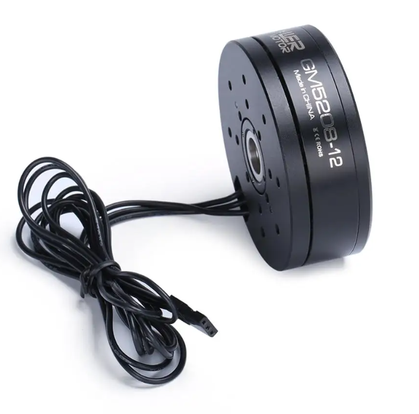
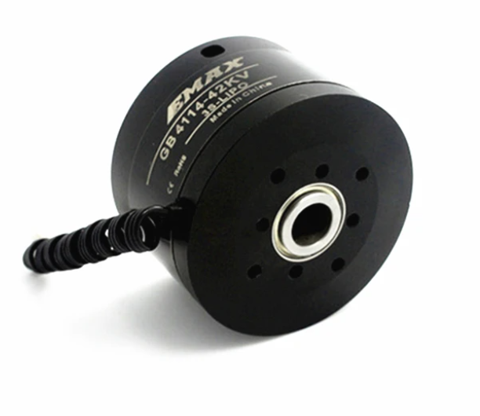
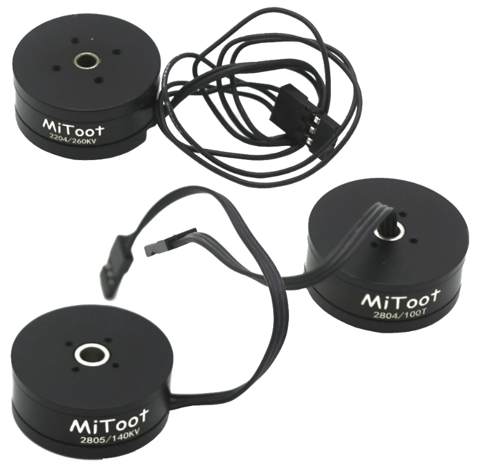

# Tested motors

!!! Tip annotate "Tip" 
    Look for the motors that have phase resistance ranging from 2 - 24 ohm.

## **Tested motors**
Motor | Name | Specifications | Link  
---- | ---- | ---- | ---- 
.
    
 |BGM8108| Pole pairs: 21   Weight: 219 g    Phase to phase Resistance: 9.3 ohm    KV: | [Link](https://es.aliexpress.com/item/2008157492.html)
.
    
 |GBM5208|Pole pairs: 21   Weight: 219 g    Phase to phase Resistance: 9.3 ohm   KV:|[Link](https://www.aliexpress.com/item/32664870804.html)
.
    
 |42BLS40-24-01|Pole pairs: 21   Weight: 219 g    Phase to phase Resistance: 9.3 ohm   KV:| [Link](https://www.omc-stepperonline.com/24v-4000rpm-0-0625nm-26w-1-8a-42x42x40mm-brushless-dc-motor-42bls40-24-01?tracking=6543849d6ff69)
.
    
 |2804|Pole pairs: 21   Weight: 219 g    Phase to phase Resistance: 9.3 ohm   KV:|[Link](https://s.click.aliexpress.com/e/_DlEUo81)
.
    
 |2804|Pole pairs: 21   Weight: 219 g    Phase to phase Resistance: 9.3 ohm   KV:| [Link](https://s.click.aliexpress.com/e/_DlQJp3T)
.
    
 |GM5208|Pole pairs: 21   Weight: 219 g    Phase to phase Resistance: 9.3 ohm   KV: |  [Link](https://s.click.aliexpress.com/e/_Dd82dTF)
.
    
 |GB4114|Pole pairs: 21   Weight: 219 g    Phase to phase Resistance: 9.3 ohm   KV:|[Link](https://s.click.aliexpress.com/e/_DDVlOFR)
.
    
 |GM8112|Pole pairs: 21   Weight: 219 g    Phase to phase Resistance: 9.3 ohm   KV:|[Link](https://s.click.aliexpress.com/e/_Dc6I1bx)
.
    
 |GM7008H|Pole pairs: 21   Weight: 219 g    Phase to phase Resistance: 9.3 ohm   KV:|[Link](https://s.click.aliexpress.com/e/_DBY6U9T)
.
    
 |GM6008H|Pole pairs: 21   Weight: 219 g    Phase to phase Resistance: 9.3 ohm   KV:|[Link](https://s.click.aliexpress.com/e/_DDPsXZn)
.
    
 |GBM5010|Pole pairs: 21   Weight: 219 g    Phase to phase Resistance: 9.3 ohm   KV:|[Link](https://s.click.aliexpress.com/e/_DlJ8vJb)
.
    
 |2804 100KV|Pole pairs: 21   Weight: 219 g    Phase to phase Resistance: 9.3 ohm   KV:|[Link](https://s.click.aliexpress.com/e/_DdeNXK1)

